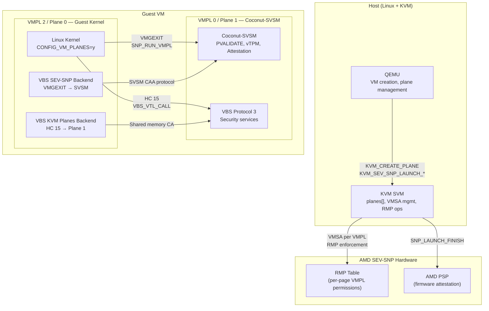
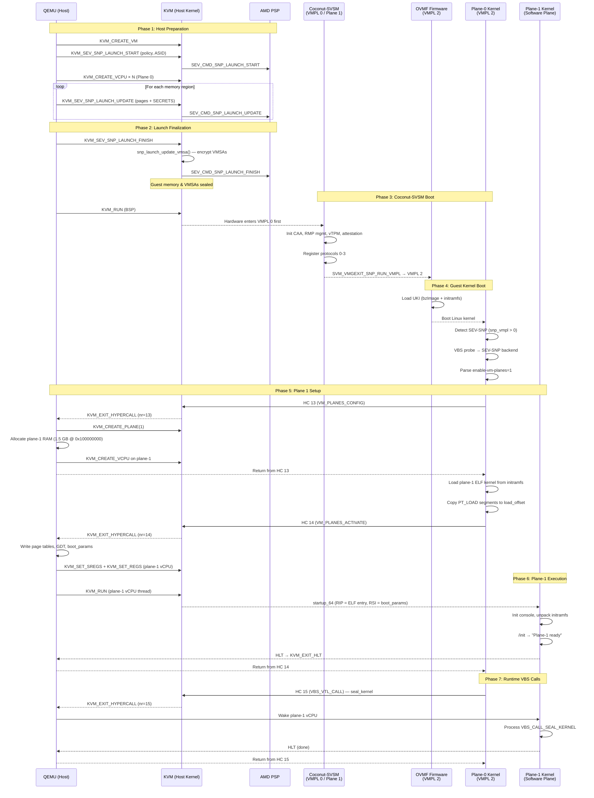
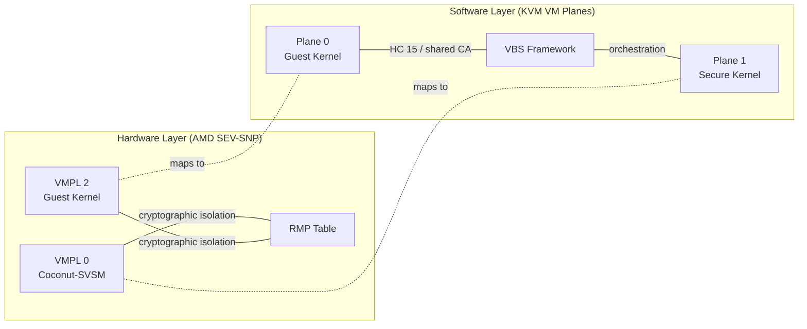

# VM Planes Architecture Diagram

## Boot Sequence Diagram

## Dual Security Layers

| Layer | Mechanism | Enforced By | Provides |
|-------|-----------|-------------|----------|
| **Hardware** | VMPL 0 (SVSM) vs VMPL 2 (guest) | AMD RMP table, PSP firmware | Cryptographic memory isolation, attestation |
| **Software** | Plane 1 (secure kernel) vs Plane 0 (guest kernel) | KVM plane isolation, separate vCPU arrays | Orchestration, kernel integrity (HEKI), module validation, kexec control |
